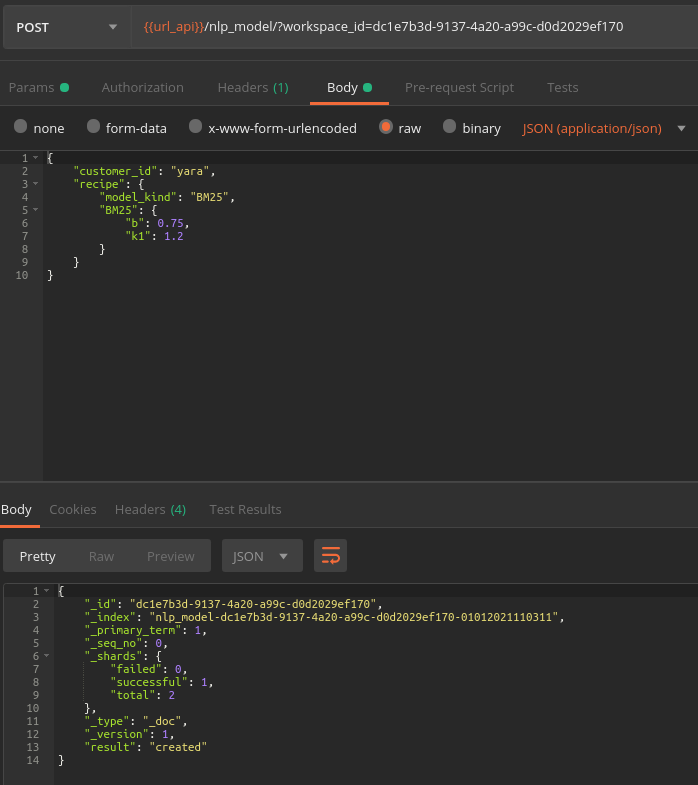
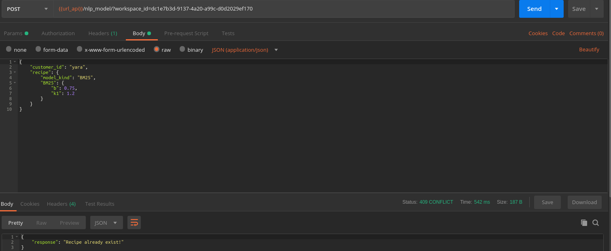
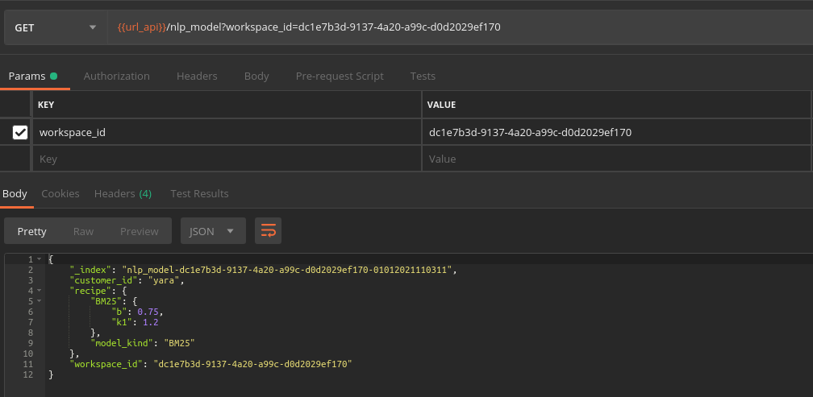
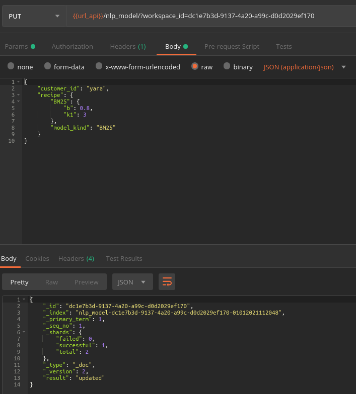
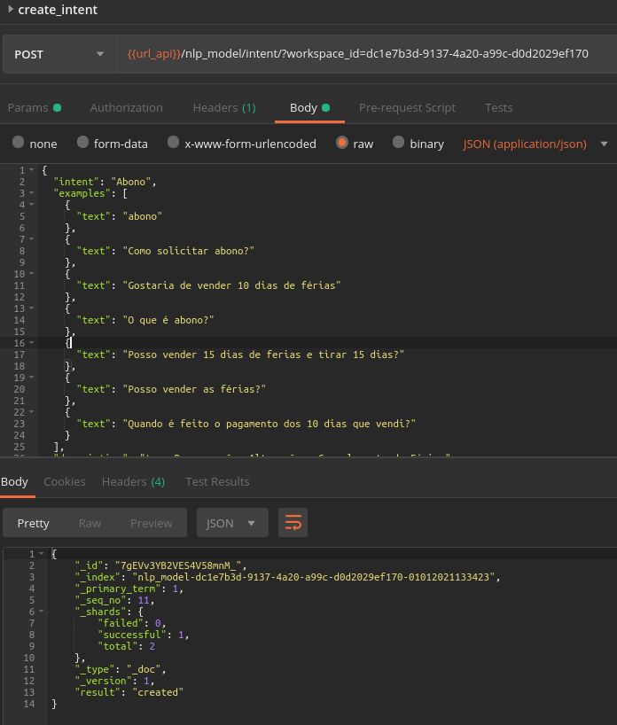
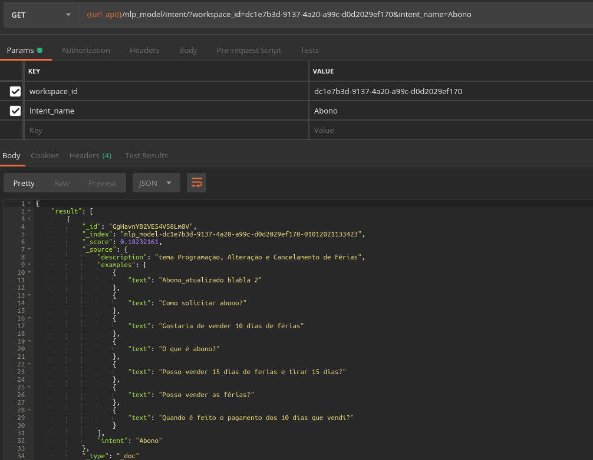
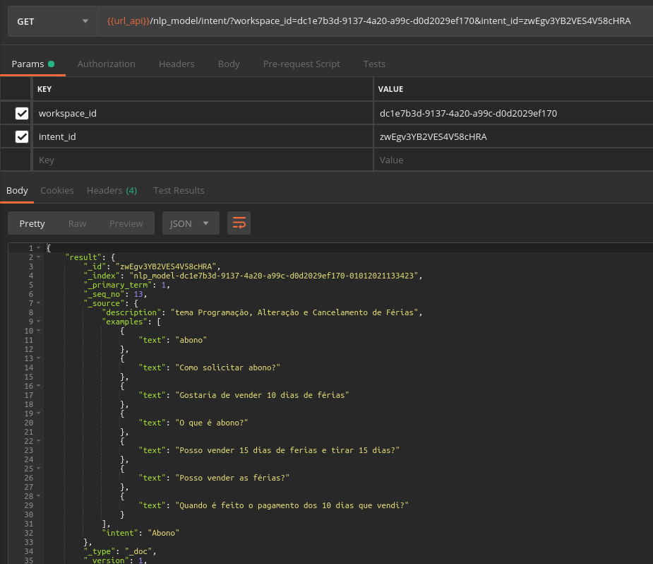
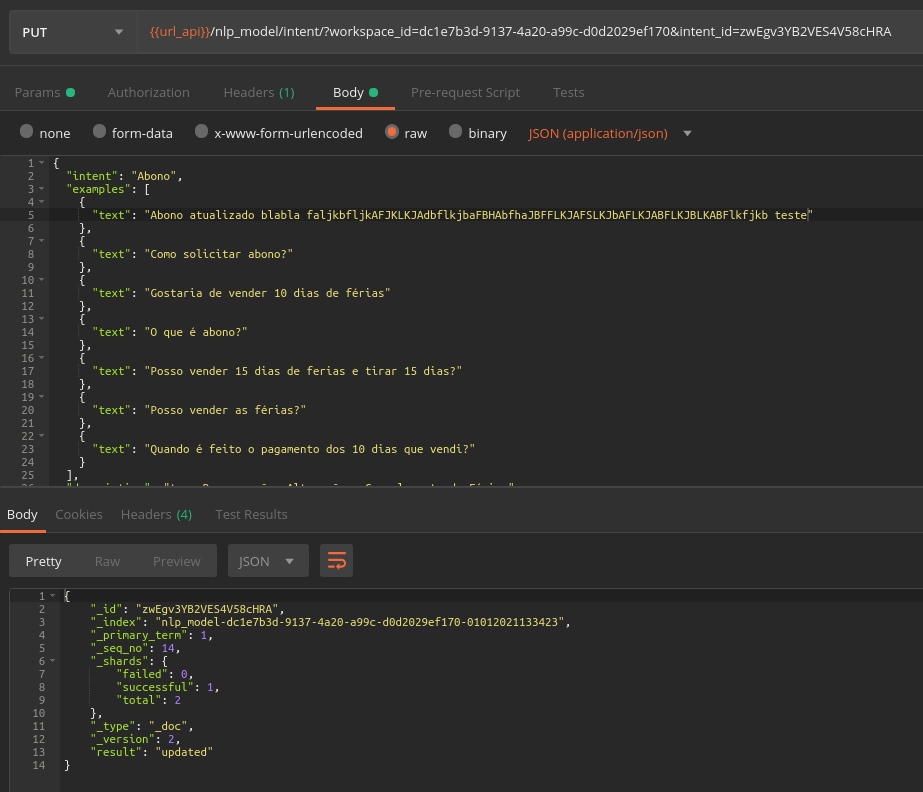
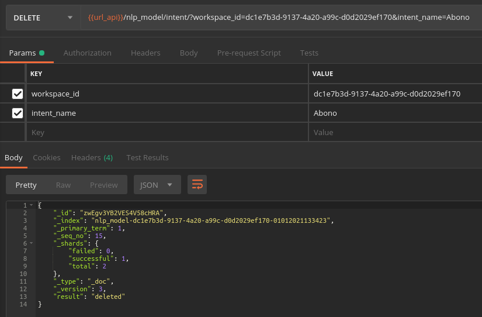
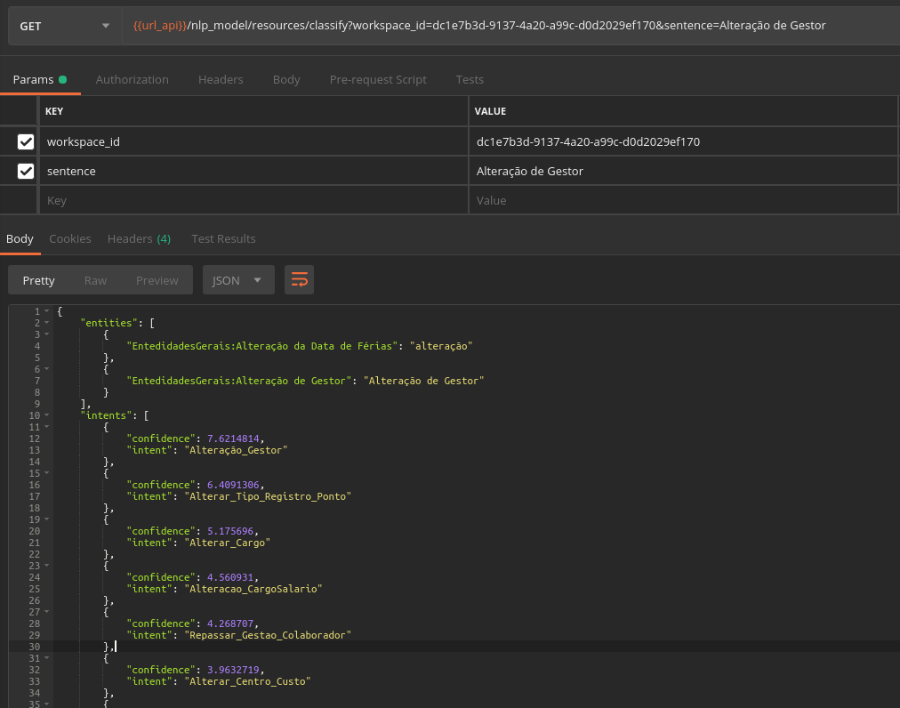

# 1 - Omni NLU API

The purpose of this project is to provide NLU resources for Omni Chatbuilder.

This project use the [Py-GreenHouse](https://github.com/felipepenha/py-greenhouse) as a MLOps template.

# 2 - Local OS Requirements

These are requirements for your local machine, ideally a Debian Linux OS:

* [docker](https://docs.docker.com/engine/install/): follow the [instructions in the docker docs](https://docs.docker.com/engine/install/linux-postinstall/) to ensure that $USER has root access to docker.

* [docker-compose](https://docs.docker.com/compose/install/).

* [VS Code](https://code.visualstudio.com/docs/setup/linux): install the [`ms-vscode-remote.remote-containers`](https://marketplace.visualstudio.com/items?itemName=ms-vscode-remote.remote-containers) extension locally. A pop-up will open up asking if you would like to reload the workspace in the container. After choosing "Reopen in Container", VS Code will open the "bash" docker-compose service in the Omni NLU API container, as specified in the manifest `.devcontainer.json`. Notice that VS Code will run intilization commands that may take some time to process. VS Code will already include the [`ms-python.python`](https://marketplace.visualstudio.com/items?itemName=ms-python.python) extension, without the need to install it in your own local machine. You may add any other extensions that you may need in your Python project in the configuration file `.devcontainer.json` .

*  [git](https://git-scm.com/download/linux):
    ```
    sudo apt-get git
    ```

*  make:

    ```
    sudo apt-get update
    sudo apt-get install build-essential
    ```

* python3:

    ```
    sudo apt-get update
    sudo apt-get install python3
    ```

* pip3

    ```
    sudo apt-get update
    sudo apt-get install python3-pip
    ```

* pre-commit

    ```
    pip3 install pre-commit
    pre-commit install
    pre-commit migrate-config
    pre-commit autoupdate
    ```

    Or, simply run in the terminal `make install-requirements`, to install the `pre-commit` Python package.

**Do I need to install any other requirements?** No! After installing the basic local requirements described above, you are all set to run everything else inside a Docker container.

# Quick Start

First, make sure `make`, `docker` and `docker-compose` are installed in your system.

The greenhouse dev work is performed via `make` commands.

To see the most up to date list of available commands run

```bash
$ make help

USAGE

    make <command>
    Include 'sudo' when necessary.
    To avoid using sudo, follow the steps in
    https://docs.docker.com/engine/install/linux-postinstall/


COMMANDS

    build           build image using cache
    build-no-cache  build image from scratch, and not from cache
    bash            bash REPL (Read-Eval-Print loop), suitable for debugging
    python3         access Python through the REPL (Read-Eval-Print loop)
    jupyter         access Python through the Jupyter Notebook
    release         Release on the dev branch

```


To build your greenhouse (as it is), you first need to run:

```bash
$ make build-no-cache
```


To access Jupyter in your local browser:

```bash
$ make jupyter

Use Control-C to stop this server and shut down all kernels (twice to skip confirmation).
    
    To access the notebook, open this file in a browser:
        file:///root/.local/share/jupyter/runtime/nbserver-1-open.html
    Or copy and paste one of these URLs:
        http://...:8888/lab?token=...
```


Next, you simply need to follow the instructions printed out on your own terminal.


In the generic example above, I would paste the following on my browser:

```bash
http://...:8888/lab?token=...
```


Any changes made in the files within the Jupyter interface, for example saved changes in `.rs`, `.ipynb`, and `.py` files, will be reflected in the original files you store locally, and vice-versa. This is ensured by the fact that the whole greenhouse directory is set as a `volume` in the `docker-compose.yml` configuration file.


You may also choose to run code using the REPL (Read-Eval-Print loop) in the terminal by running:

```bash
$ make python3
```


Now, you are ready to start developing Python code by creating new `.py` files in the `/src` directory.


During development phase, you can normally test out new code in a Jupyter Notebook.

Check out additional examples in the `/notebooks` directory (`.ipynb` files with preffix `example_`).

### 3 - Authentications

Something here soon...

### 1 - Index for NLU Model

To create an index that will store all training information for machine learning models, simply inform workspace_id and customer_id

| Field | Type | Description
| ------ | ------ | ------ |
| ```workspace_id``` | ```string``` | The id of the work space.
| ```customer_id``` | ```string``` | The id of our customer. This id will be used to track customer spending.

#### 1.1 -  Create

```
POST {url_api}/nlp_model/:workspace_id
```
Expected to receive the nlp_model object.



A conflict message will be displayed if a model already exists for workspace_id.



#### 1.2 - Read

```
GET {url_api}/nlp_model/:workspace_id
```

An example:



#### 1.3 - Update

It's not possible to update a specific field, it is necessary to pass the entire nlp_model object with the desired fields updated.

```
PUT {url_api}/nlp_model/:workspace_id
```

An example:



#### 1.4 - Delete

To delete the entire index where the model associated with the workspace is:

```
DELETE {url_api}/nlp_model/:workspace_id
```

This will delete the entire elasticsearch index content. You will get back the elasticsearch delete response.

An example:


### 2 - Intents

Intentions are the main ingredients for training the model.

| Field | Type | Description
| ------ | ------ | ------ |
| ```intent``` | ```string``` | The intent name.
| ```examples``` | ```array of objects``` | A list of objects ```{"text": "some text here"}``` with text examples to train the machine to recognize this intent.

The following is an example of *intent* object:

```json
{
  "intent": "Abono",
  "examples": [
    {
      "text": "abono"
    },
    {
      "text": "Como solicitar abono?"
    },
    {
      "text": "Gostaria de vender 10 dias de férias"
    },
    {
      "text": "O que é abono?"
    },
    {
      "text": "Posso vender 15 dias de ferias e tirar 15 dias?"
    },
    {
      "text": "Posso vender as férias?"
    },
    {
      "text": "Quando é feito o pagamento dos 10 dias que vendi?"
    }
  ],
  "description": "tema Programação, Alteração e Cancelamento de Férias"
}
```

### 2.1 Create

To create and  a new intent:

```
POST {url_api}/nlp_model/intents/:workspace_id
```

An example:



#### 2.2 - READ

You can read by intent name:

```
GET {url_api}/nlp_model/intents/:workspace_id&:intent_name
```
An example:




Or by intent id:

```
GET {url_api}/nlp_model/intents/:workspace_id&:intent_id
```

An example:



#### 2.3 - Update
You can only update the entire intent, so it is expected that the entire intent will be passed in a json format.

To update intent by id:
 ```
 PUT {url_api}/nlp_model/intents/:workspace_id&:intent_id
 ```

An example:



To update intent by name:

 ```
PUT {url_api}/nlp_model/intents/:workspace_id&:intent_name
```


#### 2.4 Delete

To delete by intent name:

```
 DELETE {url_api}/nlp_model/intents/:workspace_id&:intent_name
```

An example:



To delete by intent id:

```
 DELETE {url_api}/nlp_model/intents/:workspace_id&:intent_id
```


### 3 - Entities

Entities are useful information to contextualize the user's intent. Think of *entities* as nouns and *intentions* as verbs. For example, if the *intention* is to buy, the *entity* could be a product.

Entities can be of two types:

* **synonyms**: A word and its synonyms. This type of entity is allowed to use [fuzzy-match](https://en.wikipedia.org/wiki/Approximate_string_matching). For example, let's suppose we have an entity for a ```cities```, its values could be:
    * value ```Rio de Janeiro``` and its synonyms ```Rio, RJ```;
    * value ```São Paulo``` and its synonyms ```SP, Sampa, Terra da Garoa```

* **patterns**: An entity that has a very well-defined pattern and could be expressed by a ```regex```. For example: date formats, e-mail, CPF, telephone number, numbers, monetary values, etc.

Entities can be inserted in the examples of training intentions. For example:

```json
{
  "intent": "Abono",
  "examples": [
    {
      "text": "Gostaria de vender @sysNumber dias de férias"
    },
    {
      "text": "Minhas férias começam em no dia @sysDate e vai até dia @sys_date. Eu poderia voltar de férias dia @sys_date e vender o restante?"
    },
    {
      "text": "Quando é feito o pagamento dos @sysNumbers dias que vendi? Estou esperando receber @sysMonetary"
    }
  ]
}
```
See that instead of writing, for example, *15* I wrote ```@sysNumbers```, instead of writing *11/12/2020* I wrote ```@sysDates``` and instead of writing *R$ 1000.00* I wrote ```@sysMonetary```. This way, the machine will know that when the customer intends to *Abono* he will use dates, numbers and monetary values.

All entities that start with *sys* are default entities in the Omni NLP api. They are:

* ```sysNumbers:number```
* ```sysDates:date```
* ```sysTime:time```
* ```sysContact:email,phoneNumber```
* ```sysMonetary:reais,dollar,euro```

#### 3.1 - Create

```
POST {url_api}/nlp_model/{workspace_id}/recipe/entities/
```

Expected to receive the following parameters:

| Field | Type | Description
| ------ | ------ | ------ |
| ```entity``` | ```string``` | The entity name.
| ```values``` | ```array of objects``` | A list of objects ```{"type": "<'patterns' or 'synonyms'>", "value": "<value name>", "patterns": "<array of regex or synonyms>"}```.
| ```fuzzy_match``` | ```boolean``` | This field could be ```true``` just for *synonyms* entity type.

A example of entity of type pattern:

```json
{
    "entity": "ContactInfo",
    "values": [
        {
          "type": "patterns",
          "value": "email",
          "patterns": [
            "\\b[A-Za-z0-9._%+-]+@[A-Za-z0-9.-]+\\.[A-Za-z]{2,}\\b",
            "^[a-zA-Z0-9.!#$%&'*+/=?^_`{|}~-]+@[a-zA-Z0-9](?:[a-zA-Z0-9-]{0,61}[a-zA-Z0-9])?(?:\\.[a-zA-Z0-9](?:[a-zA-Z0-9-]{0,61}[a-zA-Z0-9])?)*$"
          ]
        },
        {
          "type": "patterns",
          "value": "telefone",
          "patterns": [
            "^\\s?\\(?\\d{2,3}\\)?[\\s-]?\\d{4,5}-?\\d{4}\\s?$"
          ]
        }
      ],
    "fuzzy_match": false
}
```

A example of entity of type synonym:

```json
{
    "entity": "CulturaPlatacao",
    "values": [
        {
          "type": "synonyms",
          "value": "Café",
          "synonyms": []
        },
        {
          "type": "synonyms",
          "value": "Cana-de-Açúcar",
          "synonyms": ["cana"]
        },
        {
          "type": "synonyms",
          "value": "Mandioca",
          "synonyms": ["macaxeira", "aipim", "castelinha", "uaipi", "mandioca-doce", "mandioca-mansa", "maniva", "maniveira", "pão-de-pobre", "mandioca-brava" e "mandioca-amarga"]
        }
      ],
    "fuzzy_match": true
}
```

You will get back a entity id.

#### 3.2 - READ

To update whole entity:

```
GET {url_api}/nlp_model/{workspace_id}/recipe/entities/{id}
```

To read just the entety name:

 ```
 GET {url_api}/nlp_model/{workspace_id}/recipe/entities/{id}/entity
 ```

To read values:

```
 GET {url_api}/nlp_model/{workspace_id}/recipe/entities/{id}/values
```

To read a specific value:

```
 GET {url_api}/nlp_model/{workspace_id}/recipe/entities/{id}/values/{index}
```

#### 3.3 - Update

To update entire entity:
```
PUT {url_api}/nlp_model/{workspace_id}/recipe/entities/{id}
```

To update just the entety name:

 ```
 PATCH {url_api}/nlp_model/{workspace_id}/recipe/entities/{id}/entity
 ```

To update values:

```
 PATCH {url_api}/nlp_model/{workspace_id}/recipe/entities/{id}/values
```

To update a specific value:

```
 PATCH {url_api}/nlp_model/{workspace_id}/recipe/entities/{id}/values/{index}
```


#### 3.4 Delete

```
 DELETE {url_api}/nlp_model/{workspace_id}/recipe/entities/{id}
```
To update just the entety name:

 ```
 PATCH {url_api}/nlp_model/{workspace_id}/recipe/entities/{id}/entity
 ```

To update values:

```
 PATCH {url_api}/nlp_model/{workspace_id}/recipe/entities/{id}/values
```

To update a specific value:

```
 PATCH {url_api}/nlp_model/{workspace_id}/recipe/entities/{id}/values/{index}
```
# 4 - Resources

Here you will find resources for intent classification and match entities in text.

#### 4.1 - Train the Model

After having all the recipe ready, you need to explicitly ask to train the model:

```
POST {url_api}/nlp_model/{workspace_id}/train
```

#### 4.2 - To Get Entities Values Inside Text

After to train the model, we can classify sentences and obtain entities:

```
GET {url_api}/nlp_model/{workspace_id}/entities/find/
```
Expected to receive the following parameters:

```json
{
	"sentence": "meu aniversário é dia 26 de dezembro de 1989, primeiro de abril é dia da mentira, me mudei para são paulo dia 28/06/2013",
	"entity_name": "sysDates",
	"entity_value": "date"
}
```

You will get back the value entities found in the sentence:

```json
{
    "matchs": [
        "28/06/2013",
        "26 de dezembro",
        "primeiro de abril"
    ]
}
```

#### 4.3 - Classify Sentences

The to classify sentences you can use the following endpoint:

```sh
GET {url_api}/nlp_model/resources/classify
```

Expected to receive the the user sentence and workspace_id as parameters:

You will get back the intents and entities identified in the sentence as result:

```json
{
    "entities": [
        {
            "EntedidadesGerais:Alteração da Data de Férias": "alteração"
        },
        {
            "EntedidadesGerais:Alteração de Gestor": "Alteração de Gestor"
        }
    ],
    "intents": [
        {
            "confidence": 7.6214814,
            "intent": "Alteração_Gestor"
        },
        {
            "confidence": 6.4091306,
            "intent": "Alterar_Tipo_Registro_Ponto"
        },
        {
            "confidence": 5.175696,
            "intent": "Alterar_Cargo"
        },
        {
            "confidence": 4.560931,
            "intent": "Alteracao_CargoSalario"
        },
        {
            "confidence": 4.268707,
            "intent": "Repassar_Gestao_Colaborador"
        },
        {
            "confidence": 3.9632719,
            "intent": "Alterar_Centro_Custo"
        },
        {
            "confidence": 3.9403086,
            "intent": "Alterar_Vale_RefeicaoAlimentacao"
        },
        {
            "confidence": 3.9037752,
            "intent": "Concur_Cursos"
        },
        {
            "confidence": 3.849194,
            "intent": "Alterar_Aprovador"
        },
        {
            "confidence": 3.7294798,
            "intent": "IncluirRemover_Colaborador"
        }
    ]
}
```
This way we can keep using sintax like ```intents[0].intent``` and ```intents[0].confidence```  in our dialog flows.

An example:


