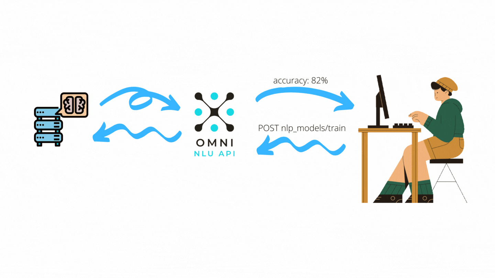
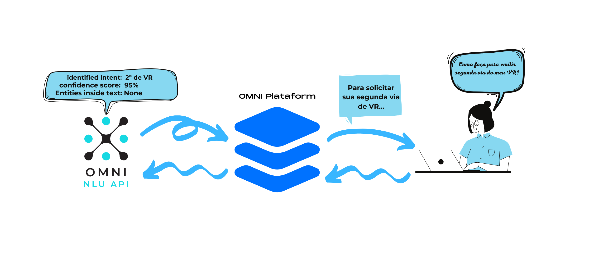
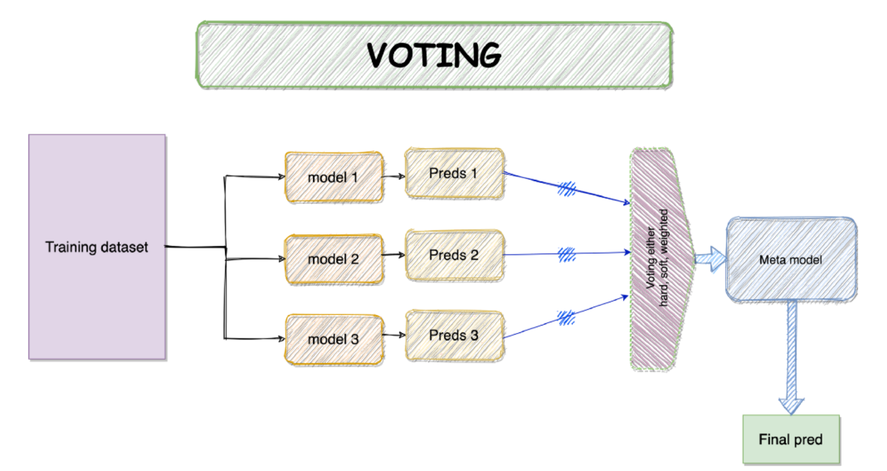

# 1 - Introduction

The purpose of this project is to provide NLU resources for Omni Plataform.

It helps to train Machine Learning Models (MLM):



And feed the Omni Plataform with these MLM resources:



# 2 - How to run this project in my local OS?

These are requirements for your local machine, ideally a Debian Linux OS:

* **docker**

* **docker-compose**

* **VS Code**: install the [`ms-vscode-remote.remote-containers`](https://marketplace.visualstudio.com/items?itemName=ms-vscode-remote.remote-containers) extension locally. A pop-up will open up asking if you would like to reload the workspace in the container. After choosing "Reopen in Container", VS Code will open the "bash" docker-compose service in the Omni NLU API container, as specified in the manifest `.devcontainer.json`. Notice that VS Code will run intilization commands that may take some time to process. VS Code will already include the [`ms-python.python`](https://marketplace.visualstudio.com/items?itemName=ms-python.python) extension, without the need to install it in your own local machine. You may add any other extensions that you may need in your Python project in the configuration file `.devcontainer.json` .

*  **git**

*  **make**: to have make in your local OS, please run the following commands:

    ```
    sudo apt-get update
    sudo apt-get install build-essential
    ```

* **python3.6**

* **pip3**

* **pre-commit**: after you have *make* in you local OS, run  `make install-requirements`


The Omni NLU API is performed via `make` commands.

To see the commands run:

```bash
$ make help
```

To build the project run:

```bash
$ make build-up
```
To access the Jupyter Notebooks of the project in your local browser, run:

```bash
$ make jupyter
```
To use python shell inside container run:

```bash
$ make python3
```

To use bash inside container run:

```bash
$ make bash
```

# Conventions used in this project

Before to make any contribution to Omni NLU API, make sure that you are familiar with the conventions of this project:

* **git-flow as the branching model**: please read [Introducing GitFlow](https://datasift.github.io/gitflow/IntroducingGitFlow.html) and use [git-flow cheatsheet](http://danielkummer.github.io/git-flow-cheatsheet/).

* **conventional commits**: write your commit messages following the standards defined [here](https://www.conventionalcommits.org/en/v1.0.0/).


# Postman Colection

You can try the Omni NLU API using the following public collections in you descktop Postman:

* [CRUD entities](https://estatisticacaps.postman.co/collections/7003300-0c6716e6-5d23-4025-a575-d316171eb372?workspace=7408cb64-1ce3-44b5-93e6-f7d5f44cfa42)
* [CRUD intents](https://estatisticacaps.postman.co/collections/7003300-b5c0ff06-bcab-45f3-8aa4-14400cdaca5b?workspace=7408cb64-1ce3-44b5-93e6-f7d5f44cfa42)
* [CRUD NLP Models Settings](https://estatisticacaps.postman.co/collections/7003300-036770e9-d3a9-4a6d-be37-69069d5ff229?workspace=7408cb64-1ce3-44b5-93e6-f7d5f44cfa42)
* [Classification Resources](https://estatisticacaps.postman.co/collections/7003300-873ff05e-662b-421a-ad6f-db8f4b739214?workspace=7408cb64-1ce3-44b5-93e6-f7d5f44cfa42)


# 3 - Authentications

Something here soon...

# 4 - The Recipe Object

The recipe object contains the ingredients to build the models, the info about the client and the workspace id of the Chatbuilder.

| Field | Type | Description
| ------ | ------ | ------ |
| ```customer_id``` | ```string``` | The cliente id, or the client name. Ex: ```yara```.
| ```workspace_id``` | ```string``` | The workspace id of the Chatbuilder where the chatbot designer is working.
| ```recipe``` | ```array of objects``` | A array of objects, each object contain hyperparameters settings of a especific model model of the ensemble.

The Omni NLU API use the Problem Representation Desing Pattern nº 7 called Stacking Ensemble, described in the book [Machine Learning Design Patterns](https://www.oreilly.com/library/view/machine-learning-design/9781098115777/) in the pages 103-104 and 106. 



Currentily, the models of our ensemble are tree:

* **Dense Neural Network**
* **Suport Vector Machine (SVM)**: you are able to set any hyperparameters documented [here](https://scikit-learn.org/stable/modules/generated/sklearn.svm.SVC.html).
* **Logistic Regression**: you are able to set any hyperparameters documented [here](https://scikit-learn.org/stable/modules/generated/sklearn.linear_model.LogisticRegression.html).

 Here is the default recipe:

 ```json
  [
   {
      "model": "cnn",
      "settings": {
        "intermediate_layers": [
              {"activation":"relu"}
        ],
        "loss": "categorical_crossentropy",
        "epochs":100,
        "batch_size":100,
        "learning_rate":0.001
    }
   },
   {
      "model": "logit",
      "settings": {
        "C":5.0, 
        "fit_intercept":false,
        "random_state":1
      }
    },
    {
      "model": "svm",
      "settings": { 
          "degree":1, 
          "coef0":0.0, 
          "random_state":42
      }
    }
]
 ```

 Following we have a exemple of a complete recipe object:

```json
{
    "workspace_id": "dc1e7b3d-9137-4a20-a99c-d0d2029ef170",
    "customer_id": "yara",
    "recipe": [{
        "model": "cnn",
        "settings": {
          "intermediate_layers": [
                {"activation":"relu"}
          ],
          "loss": "categorical_crossentropy",
          "epochs":100,
          "batch_size":100,
          "learning_rate":0.001
        }
      },
      {
        "model": "logit",
        "settings": {
          "C":5.0, 
          "fit_intercept":false,
          "random_state":1
        }
      },
      {
        "model": "svm",
        "settings": { 
            "degree":1, 
            "coef0":0.0, 
            "random_state":42
        }
      }]
}
```

#### 4.1 -  Create


#### 4.2 - Read

Something here soon...

#### 4.3 - Update

Something here soon...

#### 4.4 - Delete

Something here soon...

# 5 - Intents

Intentions are the main ingredients for training the model.

| Field | Type | Description
| ------ | ------ | ------ |
| ```intent``` | ```string``` | The intent name.
| ```examples``` | ```array of objects``` | A list of objects ```{"text": "some text here"}``` with text examples to train the machine to recognize this intent.

The following is an example of *intent* object:

```json
{
  "intent": "Abono",
  "examples": [
    {
      "text": "abono"
    },
    {
      "text": "Como solicitar abono?"
    },
    {
      "text": "Gostaria de vender 10 dias de férias"
    },
    {
      "text": "O que é abono?"
    },
    {
      "text": "Posso vender 15 dias de ferias e tirar 15 dias?"
    },
    {
      "text": "Posso vender as férias?"
    },
    {
      "text": "Quando é feito o pagamento dos 10 dias que vendi?"
    }
  ],
  "description": "tema Programação, Alteração e Cancelamento de Férias"
}
```

#### 5.1 Create

Something here soon...


#### 5.2 - READ

Something here soon...

#### 5.3 - Update

Something here soon...


#### 5.4 Delete

Something here soon...


# 6 - Entities

Entities are useful information to contextualize the user's intent. Think of *entities* as nouns and *intentions* as verbs. For example, if the *intention* is to buy, the *entity* could be a product.

Entities can be of two types:

* **synonyms**: A word and its synonyms. This type of entity is allowed to use [fuzzy-match](https://en.wikipedia.org/wiki/Approximate_string_matching). For example, let's suppose we have an entity for a ```cities```, its values could be:
    * value ```Rio de Janeiro``` and its synonyms ```Rio, RJ```;
    * value ```São Paulo``` and its synonyms ```SP, Sampa, Terra da Garoa```

* **patterns**: An entity that has a very well-defined pattern and could be expressed by a ```regex```. For example: date formats, e-mail, CPF, telephone number, numbers, monetary values, etc.

Entities can be inserted in the examples of training intentions. For example:

```json
{
  "intent": "Abono",
  "examples": [
    {
      "text": "Gostaria de vender @sysNumber dias de férias"
    },
    {
      "text": "Minhas férias começam em no dia @sysDate e vai até dia @sys_date. Eu poderia voltar de férias dia @sys_date e vender o restante?"
    },
    {
      "text": "Quando é feito o pagamento dos @sysNumbers dias que vendi? Estou esperando receber @sysMonetary"
    }
  ]
}
```
See that instead of writing, for example, *15* I wrote ```@sysNumbers```, instead of writing *11/12/2020* I wrote ```@sysDates``` and instead of writing *R$ 1000.00* I wrote ```@sysMonetary```. This way, the machine will know that when the customer intends to *Abono* he will use dates, numbers and monetary values.


#### 6.1 - Create


A example of entity of type pattern:

```json
{
    "entity": "ContactInfo",
    "values": [
        {
          "type": "patterns",
          "value": "email",
          "patterns": [
            "\\b[A-Za-z0-9._%+-]+@[A-Za-z0-9.-]+\\.[A-Za-z]{2,}\\b",
            "^[a-zA-Z0-9.!#$%&'*+/=?^_`{|}~-]+@[a-zA-Z0-9](?:[a-zA-Z0-9-]{0,61}[a-zA-Z0-9])?(?:\\.[a-zA-Z0-9](?:[a-zA-Z0-9-]{0,61}[a-zA-Z0-9])?)*$"
          ]
        },
        {
          "type": "patterns",
          "value": "telefone",
          "patterns": [
            "^\\s?\\(?\\d{2,3}\\)?[\\s-]?\\d{4,5}-?\\d{4}\\s?$"
          ]
        }
      ],
    "fuzzy_match": false
}
```

A example of entity of type synonym:

```json
{
    "entity": "CulturaPlatacao",
    "values": [
        {
          "type": "synonyms",
          "value": "Café",
          "synonyms": []
        },
        {
          "type": "synonyms",
          "value": "Cana-de-Açúcar",
          "synonyms": ["cana"]
        },
        {
          "type": "synonyms",
          "value": "Mandioca",
          "synonyms": ["macaxeira", "aipim", "castelinha", "uaipi", "mandioca-doce", "mandioca-mansa", "maniva", "maniveira", "pão-de-pobre", "mandioca-brava" e "mandioca-amarga"]
        }
      ],
    "fuzzy_match": true
}
```

You will get back a entity id.

#### 6.2 - READ

Something here soon...

#### 6.3 - Update

Something here soon...


#### 6.4 Delete

Something here soon...

# 7 - Resources

Here you will find resources for intent classification and match entities in text.

#### 7.1 - Train the Model

Something here soon...

#### 7.2 - To Get Entities Values Inside Text

Something here soon...

# 8 - To Do

- [ ] MLOps
  - [x] Dockerfile to define container
  - [x] Docker-compose with services
  - [x] VS Code integration with Docker
  - [x] Makefile with definitions of commands, e.g. `make release`
  - [x] Git hooks
      - [x] [linting](https://medium.com/staqu-dev-logs/keeping-python-code-clean-with-pre-commit-hooks-black-flake8-and-isort-cac8b01e0ea1)
      - [x] testing (pytest)
  - [ ] Python Template for the Machine Learning Pipeline
      - [X] Reading Data
      - [X] Data Cleansing
      - [X] Feature Engineering
      - [X] Model Development
      - [ ] Performance Monitoring (logs)
      - [ ] Model Interpretation (SHAP)
  - [ ] Model Versioning, e.g. MLFlow, DVC, CML
  - [ ] CI/CD
- [ ] API
  - [X] CRUD Intents
  - [X] CRUD Enteties
  - [X] CRUD ML models settings
  - [X] Classification end point
  - [ ] Refactor to be Restfull
  - [ ] Authentication
  - [ ] User Session
- [ ] Testing
  - [X] Unitetest: tests on individual components that each have a single responsibility (ex. function that filters a list).
  - [ ] Integration tests: tests on the combined functionality of individual components (ex. data processing).
  - [ ] System tests: tests on the design of a system for expected outputs given inputs (ex. training, inference, etc.).
  - [ ] Acceptance tests: tests to verify that requirements have been met, usually referred to as User Acceptance Testing (UAT).
  - [ ] Regression tests: testing errors we've seen before to ensure new changes don't reintroduce them.
- [X] Documentation
  - [X] README
  - [X] Postman collections


